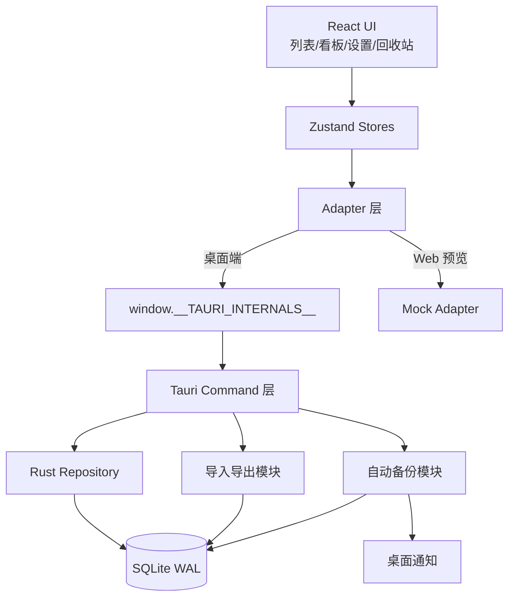

# 架构图

## 总体架构

## 分层职责

| 层 | 职责 |
| --- | --- |
| `packages/domain` | 领域模型、Repository 端口、任务状态机、纯 TypeScript |
| `packages/ui` | 设计令牌、通用组件，桌面端与未来移动端复用 |
| `apps/desktop/src` | React 视图、Zustand store、Adapter、快捷键、zod 校验 |
| `apps/desktop/src-tauri` | Tauri command、Rust repository、SQLite 迁移、备份、通知、导入导出 |

## 数据流

1. 前端通过 Zustand store 调用 Adapter。
2. 桌面端 Adapter 调用 Tauri command；Web 预览 Adapter 使用内存 Mock。
3. Rust command 在事务中读写 SQLite，并通过状态机拒绝非法流转。
4. 后台线程每分钟扫描到期任务、检查自动备份计划；到期任务触发桌面通知。
